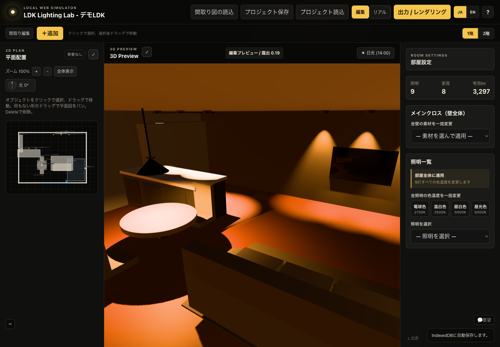

# LDK Lighting Lab

[English](README.md) | **日本語**

LDK Lighting Labは、自分の間取りで住宅照明の配置・明るさ・色温度と部屋の雰囲気を比較する、ブラウザベースの視覚シミュレーターです。

> これは照明配置と雰囲気を比較するための視覚シミュレーションです。実際の照度、配光、色、施工後の見え方を保証するものではありません。



## できること

PNG/JPG/PDFの間取り図を取り込み、部屋の要素を追加・編集して、照明の位置、明るさ、色温度、配光を2Dと3Dで比較できます。比較画像を保存し、PNGとして書き出すこともできます。

## 解決したい課題

住宅の照明は、施工前に決める必要がある一方、器具表や間取り図だけでは照明による部屋の雰囲気を想像しづらいものです。専門照明ソフトは高機能ですが、施主が照明の違いをすばやく比較するためには作られていません。

LDK Lighting Labは、実際の間取りの文脈で照明案を比較するための、軽く使いやすい手段です。専門的な照明設計、法令適合、施工図の代替ではありません。

## 想定ユーザー

- LDK、階段、吹き抜けの照明を計画する住宅購入者・施主
- 新築やリノベーション前に照明による部屋の雰囲気を比較する家族
- クライアントとの視覚的な会話に軽量ツールを使いたい設計者

## 主な機能

- 家具、照明、階段、吹き抜けを含むLDKサンプルプロジェクト
- PNG/JPG/PDF間取り図の読込と縮尺合わせ
- 壁、窓、開口、家具、照明、階段、吹き抜けを扱える2D編集
- 器具の明るさ、色温度、配光、調光、配置の編集
- 高速なラスター編集表示と、任意で使える常駐パストレーシングのリアル表示
- 最終パストレース、比較画像保存、透かし付きPNG書き出し
- IndexedDB自動保存とプロジェクトJSONの読込・保存
- ローカルストレージに選択を保存する日本語・英語UI切替

## 使い方

1. 付属のサンプルを開くか、間取り図を読み込みます。
2. 2D平面図で照明を追加・選択します。
3. 明るさ、色温度、配光、配置をインスペクターで変更します。
4. 3Dへ切り替え、対応環境では**リアル**表示で直接光と間接光を確認します。
5. 比較画像を保存するか、PNGを書き出します。

## クイックスタート

Node.js 22以降が必要です。

```bash
npm ci
npm run dev
```

Viteが表示するローカルURLを開きます。通常は `http://127.0.0.1:5173/` です。

本番ビルドを確認する場合:

```bash
npm run build
npm run preview -- --port 4173
```

## セットアップ

シミュレーターの利用にアカウントは不要です。プロジェクトは、JSONを書き出すかフィードバックを送信しない限り、ブラウザのIndexedDBに保存されます。

任意のフィードバックフォームはCloudflare Pages Functionで処理します。暗号化されたCloudflare Secretとして `GITHUB_TOKEN` と `GITHUB_REPO` が必要です。`GITHUB_REPO` は非公開のフィードバック専用リポジトリを指定してください。詳細は[フィードバック設定](docs/feedback-setup.md)を参照してください。

## テスト

```bash
npm run typecheck
npm run build
```

プレビューサーバを起動した状態で実行します。

```bash
npm run visual-check -- http://127.0.0.1:4173/
npm run exploratory-check -- http://127.0.0.1:4173/
```

CIはLinux上のChromiumでこれらのランタイムチェックを実行します。`photometric/` サブプロジェクトはCIで独自のunit test、typecheck、buildを実行します。

## サンプル導線

すぐに試す場合は、組み込みの **LDK Lighting Lab - デモLDK** プロジェクトを使います。読み込み可能なプロジェクトとオリジナルの架空間取りアセットは [public/demo](public/demo/README.md) にあります。

## レンダリング構成

- **編集表示:** PBRマテリアル、固定露出、PBR Neutralトーンマッピングによるリアルタイム・ラスター表示。
- **リアル表示:** 現在編集中のシーンを使う、任意の常駐 `three-gpu-pathtracer` 表示。カメラ操作停止後に段階的に収束します。
- **最終レンダー:** BVH準備、サンプル進捗、停止、比較画像保存、WebGL2ガードを持つ別のパストレースPNGパイプライン。
- **照度ヒートマップ:** 既存の実験的 `?lux=1` で、直接光・間接光の参考ヒートマップを表示できます。法令適合の計算ではありません。

## CodexとGPT-5.6の使用

このリポジトリには、OpenAI Build Weekの最終調整セッションより前に実装された機能が含まれます。このセッションではCodexとGPT-5.6を使い、既存アーキテクチャの調査、ビルドとブラウザ挙動の検証、フィードバック送信先の安全化、日英UI基盤の追加、文書化、検証結果の記録を行いました。既存機能とセッション内の作業の区別は、事実ベースの[Build Week開発記録](docs/build-week-development.md)にまとめています。

## 主な技術判断

- 締切直前にレンダリングエンジンを置き換えず、既存のラスターとパストレーシングを維持しました。
- パストレーシングが未対応または低速でも、ラスター編集を完了できるようにしています。
- 2言語の有限なUI範囲では、新しい依存を増やさず小さな型付き辞書を採用しました。
- フィードバックは公開ソースリポジトリではなく、非公開の専用リポジトリだけへ送信します。

## 既知の制限

- DIALux、認定照度計算、施工図ではありません。
- メーカー固有の器具カタログ、検証済みIES/LDT、CSV帳票、保証されたlux値は含みません。
- 常駐・最終パストレーシングはブラウザのWebGL2対応とGPU性能に依存します。
- PDF読込は1ページ目をラスタライズします。壁の自動認識やベクトル化は未実装です。
- 最終レンダーは軽量なレンダーシーンを再構築するため、編集用3Dメッシュのバイト単位のコピーではありません。

## プライバシーとローカルデータ

プロジェクトデータはブラウザのIndexedDBへ自動保存され、既定ではアップロードしません。JSONとPNGは明示的に書き出したときだけ作成されます。フィードバックは任意です。個人情報や機密情報は送信しないでください。

## アセットと通知

`public/demo/` のサンプル間取り図は、このリポジトリのために作成した架空のオリジナル素材です。npm依存パッケージはそれぞれのライセンスに従います。外部アセットを追加する場合は、別途サードパーティ通知を追加します。

## ライセンス

[MIT](LICENSE) — Copyright (c) 2026 Tomoharu Hoshi.
