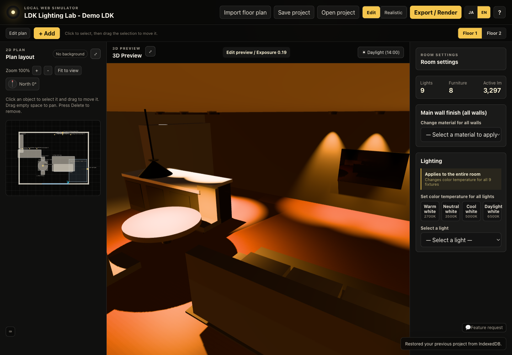
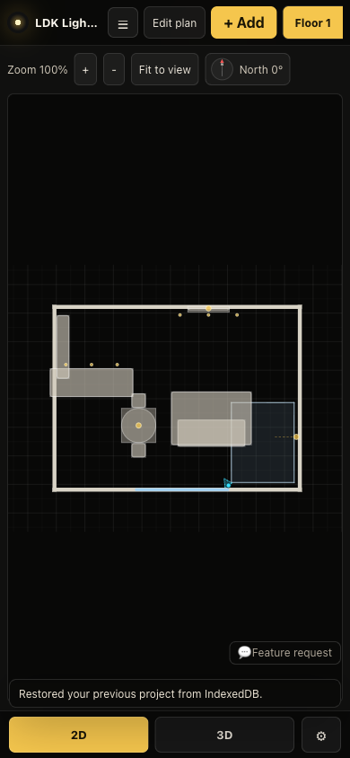

# LDK Lighting Lab

**English** | [日本語](README.ja.md)

LDK Lighting Lab is a browser-based visual simulator for comparing home lighting layouts, brightness, color temperature, and room atmosphere in your own floor plan.

> This is a visual simulation for comparing lighting layouts and atmosphere. It does not guarantee actual illuminance, light distribution, color, or the finished result.





## What it does

Import a PNG, JPG, or PDF floor plan, add and edit room elements, then compare lighting placement, brightness, color temperature, and beam distribution in 2D and 3D. Save rendered comparison shots and export them as PNG images.

## The problem it solves

Homeowners usually need to decide on lighting before construction, while it is still hard to imagine the result from a fixture schedule or a floor plan alone. Professional lighting software is powerful but not designed for a homeowner's quick comparison of how a room will feel with different lighting choices.

LDK Lighting Lab focuses on that decision: a fast, approachable way to compare ideas in the context of a real floor plan. It is not a replacement for professional lighting design, compliance checks, or construction documentation.

## Who it is for

- Homeowners and buyers planning an LDK, stairs, or double-height space
- Families comparing lighting mood before a renovation or new build
- Designers who want a lightweight visual discussion tool with a client

## Key features

- Built-in LDK sample project with furniture, fixtures, stairs, and a double-height zone
- PNG/JPG/PDF floor-plan import and scale calibration
- 2D editing for walls, windows, openings, furniture, lights, stairs, and voids
- Fixture brightness, color temperature, beam distribution, dimming, and placement controls
- Fast raster editing view and an optional live path-traced realistic view
- Final path-traced renders, saved comparison shots, and PNG export with a watermark
- IndexedDB autosave plus portable project JSON import/export
- Japanese and English UI selection, persisted in local storage

## How it works

1. Open the included sample or import your floor plan.
2. Add or select lights in the 2D plan.
3. Change brightness, color temperature, fixture distribution, and placement in the inspector.
4. Switch to 3D and use **Realistic** view to inspect direct and indirect light where supported.
5. Save a comparison shot or export a PNG.

## Quick start

Requires Node.js 22 or later.

```bash
npm ci
npm run dev
```

Open the local URL printed by Vite, normally `http://127.0.0.1:5173/`.

For a production build:

```bash
npm run build
npm run preview -- --port 4173
```

## Setup

No account is required to use the simulator. Projects are stored locally in IndexedDB unless you explicitly export a JSON file or send feedback.

The optional feedback form is handled by a Cloudflare Pages Function. It requires `GITHUB_TOKEN` and `GITHUB_REPO` as encrypted Cloudflare Secrets. `GITHUB_REPO` must point to a private feedback-only repository. See [feedback setup](docs/feedback-setup.md).

## Test

```bash
npm run typecheck
npm run build
```

With the preview server running:

```bash
npm run visual-check -- http://127.0.0.1:4173/
npm run exploratory-check -- http://127.0.0.1:4173/
```

The CI workflow runs these runtime checks on Linux with Chromium. The `photometric/` subproject has its own unit tests, typecheck, and build in CI.

## Sample workflow

Use the built-in **LDK Lighting Lab - Demo LDK** project to start immediately. For an importable project and original fictional floor-plan assets, see [public/demo](public/demo/README.md).

## Rendering architecture

- **Edit view:** real-time raster rendering with PBR materials, fixed exposure, and PBR Neutral tone mapping.
- **Realistic view:** an optional live `three-gpu-pathtracer` view using the current editing scene. It progressively converges after camera motion stops.
- **Final render:** a separate path-traced PNG pipeline with BVH preparation, sample progress, cancellation, comparison-shot storage, and WebGL2 guarding.
- **Illuminance heatmap:** a reference-only direct/indirect heatmap is available in the existing experimental `?lux=1` route. It is not a compliance calculation.

## How Codex and GPT-5.6 were used

This repository contains pre-existing functionality built before the OpenAI Build Week finalization session. During that session, Codex with GPT-5.6 inspected the existing architecture, verified builds and browser behavior, hardened the feedback destination, added bilingual UI infrastructure, prepared documentation, and recorded validation results. See the factual [Build Week development record](docs/build-week-development.md) for the distinction between pre-existing functionality and session work.

## Key technical decisions

- Preserve the existing raster and path-tracing pipelines instead of replacing the rendering engine near the deadline.
- Keep raster editing usable even when realistic path tracing is unsupported or slow.
- Use a small typed in-app dictionary instead of a new i18n dependency for two languages.
- Send feedback only to a private dedicated repository, never to the public source repository.

## Known limitations

- This is not DIALux, a certified illuminance calculation tool, or construction documentation.
- It does not include manufacturer-specific fixture catalog data, validated IES/LDT data, CSV reports, or guaranteed lux values.
- Live and final path tracing depend on browser WebGL2 support and GPU performance.
- PDF import rasterizes the first page; automatic wall recognition and vectorization are not implemented.
- The final render rebuilds a lightweight rendering scene and is not a byte-for-byte mesh copy of the editing view.

## Privacy and local data

Project data is autosaved in the browser's IndexedDB. It is not uploaded by default. Exported JSON and PNG files are created only when you choose to export them. Feedback is optional; do not include personal or sensitive information in it.

## Assets and notices

The sample floor plan in `public/demo/` is original fictional material made for this repository. The project uses open-source npm dependencies under their respective licenses. A separate third-party notice will be added if externally sourced assets are introduced.

## License

[MIT](LICENSE) — Copyright (c) 2026 Tomoharu Hoshi.
